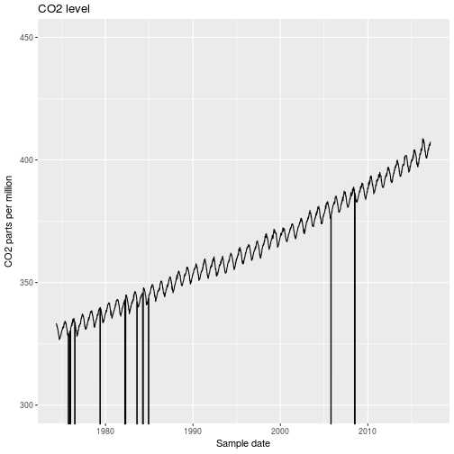

## Introduction 

Today's course uses at historic CO2 and temperature data as an example.  The focus of the course is using R for programming.  In the "Data Analysis Using R" course we covered:


  *  Introduction to R and RStudio
  *  Getting help
  *  Loading data into R
  *  Transforming and cleaning data
  *  Plotting data
  *  Finding and using packages

This episode briefly recaps these topics.  We will use the data introduced in this section in the remainder of the course.

The "Data Analysis Using R" course almost exclusively used the tidyverse.  This is a collection of packages that have been designed to work well together, and which provide an integrated way of performing data analyses.  They also hide some of the complexity underlying "base" R.    When we come to program with R, we will need to explore some of this complexity.

##  Getting started with R

RStudio is a widely used integrated development environment for R.

Cover:

* Rstudio windows
* Getting help
* Writing scripts
* Running code / scripts


## Loading data into R

Although R contains functions to load data into it, we used the tidyverse equivalents in the previous course.   We loaded CSV data using the `read_csv()` function.  For example, to load the `gapminder` data we used:


~~~
library(tidyverse)
~~~
{: .r}


~~~
Loading tidyverse: ggplot2
Loading tidyverse: tibble
Loading tidyverse: tidyr
Loading tidyverse: readr
Loading tidyverse: purrr
Loading tidyverse: dplyr
~~~
{: .output}


~~~
Conflicts with tidy packages ----------------------------------------------
~~~
{: .output}


~~~
filter(): dplyr, stats
lag():    dplyr, stats
~~~
{: .output}


~~~
gapminder <- read_csv(file = "data/gapminder-FiveYearData.csv",
                      col_types = cols(
                        country = col_character(),
                        year = col_integer(),
                        pop = col_double(),
                        continent = col_character(),
                        lifeExp = col_double(),
                        gdpPercap = col_double()
                      ) )
~~~
{: .r}

We explicitly list the column type of each variable in order to improve the robustness of our code.

FIXME - add callout noting difference between `read_csv()` and `read.csv()`

> ## Guessing column types
>
> You don't need to type all the column types out by hand.  If you run `read_csv()` without
> the `col_types` argument, it will display a list of the column types it guessed in the console.
> this list can be copy and pasted into your script, and modified if required.
> 
{: .callout}

Let's take a look at the CO2 data we will be using in this lesson:

```
# --------------------------------------------------------------------
# USE OF NOAA ESRL DATA
# 
# These data are made freely available to the public and the
# scientific community in the belief that their wide dissemination
# will lead to greater understanding and new scientific insights.
# The availability of these data does not constitute publication
# of the data.  NOAA relies on the ethics and integrity of the user to
# insure that ESRL receives fair credit for their work.  If the data 
# are obtained for potential use in a publication or presentation, 
# ESRL should be informed at the outset of the nature of this work.  
# If the ESRL data are essential to the work, or if an important 
# result or conclusion depends on the ESRL data, co-authorship
# may be appropriate.  This should be discussed at an early stage in
# the work.  Manuscripts using the ESRL data should be sent to ESRL
# for review before they are submitted for publication so we can
# insure that the quality and limitations of the data are accurately
# represented.
# 
# Contact:   Pieter Tans (303 497 6678; pieter.tans@noaa.gov)
# 
# File Creation:  Sun Mar  5 05:01:22 2017
# 
# RECIPROCITY
# 
# Use of these data implies an agreement to reciprocate.
# Laboratories making similar measurements agree to make their
# own data available to the general public and to the scientific
# community in an equally complete and easily accessible form.
# Modelers are encouraged to make available to the community,
# upon request, their own tools used in the interpretation
# of the ESRL data, namely well documented model code, transport
# fields, and additional information necessary for other
# scientists to repeat the work and to run modified versions.
# Model availability includes collaborative support for new
# users of the models.
# --------------------------------------------------------------------
#  
#  
# See www.esrl.noaa.gov/gmd/ccgg/trends/ for additional details.
#  
# NOTE: DATA FOR THE LAST SEVERAL MONTHS ARE PRELIMINARY, ARE STILL SUBJECT
# TO QUALITY CONTROL PROCEDURES.
# NOTE: The week "1 yr ago" is exactly 365 days ago, and thus does not run from
# Sunday through Saturday. 365 also ignores the possibility of a leap year.
# The week "10 yr ago" is exactly 10*365 days +3 days (for leap years) ago.
#  
#      Start of week      CO2 molfrac           (-999.99 = no data)  increase
# (yr, mon, day, decimal)    (ppm)  #days       1 yr ago  10 yr ago  since 1800
  1974   5  19  1974.3795    333.34  6          -999.99   -999.99     50.36
  1974   5  26  1974.3986    332.95  6          -999.99   -999.99     50.06
  1974   6   2  1974.4178    332.32  5          -999.99   -999.99     49.57
  1974   6   9  1974.4370    332.18  7          -999.99   -999.99     49.63
  1974   6  16  1974.4562    332.37  7          -999.99   -999.99     50.07
  ....
  
```

> ## Different file formats
>
> Compare the format of the co2 data (`co2_weekly_mlo.txt`) and the gapminder data (`gapminder-FiveYearData.csv`).
> What differences do you notice?
> 
> > ## Solution
> > 
> > The main differences are:
> > * The co2 data contains documentation and licencing information at its start.  These rows
> >   are prefixed with the # symbol.
> > * The gapminder data contains variables names in its first row (remember we cannot start an R
> >   variable with a number, and including spaces needs special tricks (and is generally a bad idea)).  The co2 data doesn't 
> >   contain variable names in a nice format.
> > * In the gapminder data each value is separated by a single comma.  In the co2 data, the values
> >   are separated by (varying numbers) of spaces.
> {: .solution}
{: .challenge}

The `read_csv()` function is designed to read comma separated files (like the gapminder data).  This isn't
going to work for the CO2 data.  There are two different approaches we can use:

* We can make sure of the fact that each variable starts in the same column in each row; this data is 
 called "fixed width", and can read with `read_fwf()`
 * We can use the fact that there is at least one space between each variable.  The data is tabular, so we use `read_table()`.
 
TODO compare pros and cons - blank missing data will break the latter, but easier to implement the former

We also have to deal with the text at the start of the file.  Fortunately the documentation text is 
preceeded with a `#` character on each row.  This can serve as a _comment_ character; just like in R.  The readr `read_xxx()` functions allow us to specify a character to treat as a comment using the `comment="#"` option.


~~~
co2weekly <- read_table("data/co2_weekly_mlo.txt",
                  comment = "#",
                  col_names = c("yyyy",
                                "mm",
                                "dd",
                                "decYear",
                                "co2Ppm",
                                "days",
                                "co2OneYearAgo",
                                "co2TenYearsAgo",
                                "co2Increase1800"),
                  col_types = cols(
                    yyyy = col_integer(),
                    mm = col_integer(),
                    dd = col_integer(),
                    decYear = col_double(),
                    co2Ppm = col_double(),
                    days = col_integer(),
                    co2OneYearAgo = col_double(),
                    co2TenYearsAgo = col_double(),
                    co2Increase1800 = col_double()
                  ))
~~~
{: .r}


As with all the readr loading functions, we obtain a tibble, which we can view directly from Rstudio (using the environment pane, which by default is in the top right), or using the `print()` function:


~~~
print(co2weekly) # use, e.g. n=100 to print more rows
~~~
{: .r}


~~~
# A tibble: 2,233 x 9
    yyyy    mm    dd  decYear co2Ppm  days co2OneYearAgo co2TenYearsAgo
   <int> <int> <int>    <dbl>  <dbl> <int>         <dbl>          <dbl>
 1  1974     5    19 1974.380 333.34     6       -999.99        -999.99
 2  1974     5    26 1974.399 332.95     6       -999.99        -999.99
 3  1974     6     2 1974.418 332.32     5       -999.99        -999.99
 4  1974     6     9 1974.437 332.18     7       -999.99        -999.99
 5  1974     6    16 1974.456 332.37     7       -999.99        -999.99
 6  1974     6    23 1974.475 331.59     6       -999.99        -999.99
 7  1974     6    30 1974.495 331.68     6       -999.99        -999.99
 8  1974     7     7 1974.514 331.44     6       -999.99        -999.99
 9  1974     7    14 1974.533 330.85     5       -999.99        -999.99
10  1974     7    21 1974.552 330.76     7       -999.99        -999.99
# ... with 2,223 more rows, and 1 more variables: co2Increase1800 <dbl>
~~~
{: .output}

In contrast to the gapminder data we used previously, it looks like we will need to clean the data-set before we use it for further analysis.  

## Dealing with missing data

It looks like `-999.99` is used as a missing or invalid data value. We can use the `mutate` command to recode the 
missing data to `NA`. To do this, we'll use the `ifelse()` function:


~~~
demodata <- 1:10
ifelse(demodata == 5, demodata, NA)
~~~
{: .r}


~~~
 [1] NA NA NA NA  5 NA NA NA NA NA
~~~
{: .output}

Let's unpick this to understand what the `ifelse()` function is doing;


~~~
demodata <- 1:10
demodata == 5
~~~
{: .r}


~~~
 [1] FALSE FALSE FALSE FALSE  TRUE FALSE FALSE FALSE FALSE FALSE
~~~
{: .output}

The first argument of `ifelse()` evaluates to a logical vector. If the ith element of the vector is `TRUE`, `ifelse()` will output the ith element of the 2nd argument (so the ith element of `demodata` in this example).  If the element is FALSE the ith element of the 3rd argument will be replaced.  But the 3rd argument is only a single value...what's going on here?  You may remember that R `recycles` vectors if they are too short. This is what happens here; as the 3rd argument in our example consists of a single value, it will be output for all elements that are  `FALSE`


~~~
co2clean <- co2weekly %>% mutate(co2Ppm = ifelse(co2Ppm == -999.99, NA, co2Ppm),
                                 co2OneYearAgo = ifelse(co2OneYearAgo == -999.99, NA, co2OneYearAgo),
                                 co2TenYearsAgo = ifelse(co2TenYearsAgo == -999.99, NA, co2TenYearsAgo))
~~~
{: .r}

This works, but there is a lot of repetition in our code.  This is bad for several reasons:

 1. It's error prone (and the errors we introduce are often very hard to spot and debug).  For example, we might mismatch variables:


~~~
co2clean <- co2weekly %>% mutate(co2Ppm = ifelse(co2Ppm == -999.99, NA, co2Ppm),
                                 co2OneYearAgo = ifelse(co2OneYearAgo == -999.99, NA, co2OneYearAgo),
                                 co2TenYearsAgo = ifelse(co2TenYearsAgo == -999.99, NA, co2OneYearsAgo))
~~~
{: .r}

or make a typing error for one of the variables:


~~~
co2clean <- co2weekly %>% mutate(co2Ppm = ifelse(co2Ppm == -999.99, NA, co2Ppm),
                                 co2OneYearAgo = ifelse(co2OneYearAgo == -999.99, NA, co2OneYearAgo),
                                 co2TenyearsAgo = ifelse(co2TenYearsAgo == -999.99, NA, co2TenYearsAgo))
~~~
{: .r}

> ## Finding typing errors
> Even if an error is reported when you run your code, errors like these can be very tricky to spot.
> If you select a variable name in RStudio (a shortcut for this is to double-click the variable name),
> it will highlight the other places in your code where the 
> variable is used.  This can make it easier to spot where a variable has been mistyped.
{: .callout}

 2. It could get very tedious; we could have hundreds of fields that we needed to recode it the same way.

This illustrates why functions are so useful.  For now, let's leave the `-999.99`s in the data, and deal with them
properly in the next episode.

## Dealing with Dates

Although we didn't cover them in the Introduction to Data Analysis course, it's worth spending a little time on dealing with date data.  It would be useful to combine the fields `yyyy`, `mm`, `dd` into a "proper" date.   The `lubridate` package, which is part of the tidyverse offers lots of functions that make dealing with dates easier.   The `lubridate` package isn't loaded by default when we use `library("tidyverse")`.

Lubridate comes with several functions to process strings that look like dates (e.g. "1 November 2017") into date objects.

TODO more on date objects - why bother making them etc.


~~~
library(lubridate)
~~~
{: .r}


~~~
Loading required package: methods
~~~
{: .output}


~~~

Attaching package: 'lubridate'
~~~
{: .output}


~~~
The following object is masked from 'package:base':

    date
~~~
{: .output}


~~~
dmy("1 November 2017")
~~~
{: .r}


~~~
[1] "2017-11-01"
~~~
{: .output}


~~~
dmy("1 Jan 2018")
~~~
{: .r}


~~~
[1] "2018-01-01"
~~~
{: .output}


~~~
dmy("1-12-2017")
~~~
{: .r}


~~~
[1] "2017-12-01"
~~~
{: .output}


~~~
mdy("12-1-2017")
~~~
{: .r}


~~~
[1] "2017-12-01"
~~~
{: .output}


~~~
dmy("13-1-2017")
~~~
{: .r}


~~~
[1] "2017-01-13"
~~~
{: .output}


~~~
# But note:
mdy("13-1-2017")
~~~
{: .r}


~~~
Warning: All formats failed to parse. No formats found.
~~~
{: .error}


~~~
[1] NA
~~~
{: .output}

We need convert our `yyyy`, `mm` and `dd` fields into a string that looks like a date. To do this we can use the `paste()` function:


~~~
paste("a", "b", "c")
~~~
{: .r}


~~~
[1] "a b c"
~~~
{: .output}

Following the tidyverse approach of pipes (` %>% `)


~~~
co2weekly %>% mutate(datestring = paste(yyyy, mm, dd)) %>%  select(yyyy, mm, dd, datestring)
~~~
{: .r}


~~~
# A tibble: 2,233 x 4
    yyyy    mm    dd datestring
   <int> <int> <int>      <chr>
 1  1974     5    19  1974 5 19
 2  1974     5    26  1974 5 26
 3  1974     6     2   1974 6 2
 4  1974     6     9   1974 6 9
 5  1974     6    16  1974 6 16
 6  1974     6    23  1974 6 23
 7  1974     6    30  1974 6 30
 8  1974     7     7   1974 7 7
 9  1974     7    14  1974 7 14
10  1974     7    21  1974 7 21
# ... with 2,223 more rows
~~~
{: .output}


~~~
# Has produced something that looks like it should parse as a date
# Note we could have pasted the yyyy mm dd fields in (almost) any order, provided we use the 
# corresponding lubridate function to convert them to a date

co2weekly %>% mutate(sampledate = ymd(paste(yyyy, mm, dd)))
~~~
{: .r}


~~~
# A tibble: 2,233 x 10
    yyyy    mm    dd  decYear co2Ppm  days co2OneYearAgo co2TenYearsAgo
   <int> <int> <int>    <dbl>  <dbl> <int>         <dbl>          <dbl>
 1  1974     5    19 1974.380 333.34     6       -999.99        -999.99
 2  1974     5    26 1974.399 332.95     6       -999.99        -999.99
 3  1974     6     2 1974.418 332.32     5       -999.99        -999.99
 4  1974     6     9 1974.437 332.18     7       -999.99        -999.99
 5  1974     6    16 1974.456 332.37     7       -999.99        -999.99
 6  1974     6    23 1974.475 331.59     6       -999.99        -999.99
 7  1974     6    30 1974.495 331.68     6       -999.99        -999.99
 8  1974     7     7 1974.514 331.44     6       -999.99        -999.99
 9  1974     7    14 1974.533 330.85     5       -999.99        -999.99
10  1974     7    21 1974.552 330.76     7       -999.99        -999.99
# ... with 2,223 more rows, and 2 more variables: co2Increase1800 <dbl>,
#   sampledate <date>
~~~
{: .output}


~~~
co2weekly <- co2weekly %>% mutate(sampledate = ymd(paste(yyyy, mm, dd))) 
~~~
{: .r}


## Plotting

We used `ggplot2` to produce graphs in the previous course.  As a recap, let's plot CO_2
concentration against time for this data-set.  `ggplot2` is loaded as part of the tidyverse.


~~~
ggplot(data = co2weekly, aes(x = sampledate, y = co2Ppm)) + geom_line() 
~~~
{: .r}


> ## Challenge:  Improving the graph
> The graph is dominated by the missing data. Dealing with this properly is the subject of the
> next episode.  Before we do this, use the ggplot cheat-sheet to work out how to
> alter the y axis of the plot to better display the data.  Alter the axis labels to something
> more informative, and give the graph a title.
> 
> > ## Solution
> >
> > 
> > ~~~
> > ggplot(data = co2weekly, aes(x = sampledate, y = co2Ppm)) +
> >  geom_line() +
> >  coord_cartesian(ylim = c(300,450))  +
> >  # scale_y_continuous(limits = c(300,450))  could also use this - note how data outside
> >  # the plot area are handled.
> >  labs(x = "Sample date",
> >       y = "CO2 parts per million",
> >       title = "CO2 level") 
> > ~~~
> > {: .r}
> > 
> > 
> > 
> {: .solution}
{: .challenge}


