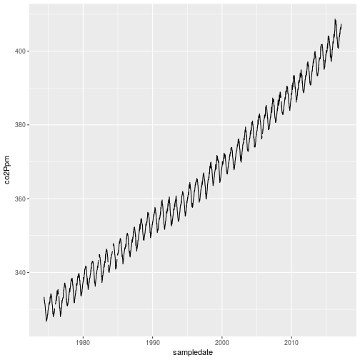

(This episode is derived from episode 2 of [Software Carpentry's Programming with R course](https://github.com/swcarpentry/r-novice-inflammation/))


In the previous episode we loaded in the CO2 data and recoded the missing values to `NA`.    In this
episode we will recode the missing values using a function.

Before we write a function to recode the missing values, let's illustrate writing a simple function to convert temperatures: 

### Defining a Function

Let's start by defining a function `fahr_to_kelvin` that converts temperatures from Fahrenheit to Kelvin:


~~~
fahr_to_kelvin <- function(temp) {
  kelvin <- ((temp - 32) * (5 / 9)) + 273.15
  return(kelvin)
}
~~~
{: .r}

We define `fahr_to_kelvin` by assigning it to the output of `function`.
The list of argument names are contained within parentheses.
Next, the [body]({{ page.root }}/reference/#function-body) of the function--the statements that are executed when it runs--is contained within curly braces (`{}`).
The statements in the body are indented by two spaces, which makes the code easier to read but does not affect how the code operates.

When we call the function, the values we pass to it are assigned to those variables so that we can use them inside the function.
Inside the function, we use a [return statement]({{ page.root }}/reference/#return-statement) to send a result back to whoever asked for it.

> ## Automatic Returns
>
> In R, it is not necessary to include the return statement.
> R automatically returns whichever variable is on the last line of the body
> of the function. Since we are just learning, we will explicitly define the
> return statement.
{: .callout}

Let's try running our function.
Calling our own function is no different from calling any other function:


~~~
# freezing point of water
fahr_to_kelvin(32)
~~~
{: .r}


~~~
[1] 273.15
~~~
{: .output}


~~~
# boiling point of water
fahr_to_kelvin(212)
~~~
{: .r}


~~~
[1] 373.15
~~~
{: .output}

We've successfully called the function that we defined, and we have access to the value that we returned.

### Composing Functions

Now that we've seen how to turn Fahrenheit into Kelvin, let's write another function to turn Kelvin into Celsius:


~~~
kelvin_to_celsius <- function(temp) {
  celsius <- temp - 273.15
  return(celsius)
}

#absolute zero in Celsius
kelvin_to_celsius(0)
~~~
{: .r}


~~~
[1] -273.15
~~~
{: .output}

What about converting Fahrenheit to Celsius?
We could write out the formula, but we don't need to.
Instead, we can [compose]({{ page.root }}/reference/#function-composition) the two functions we have already created:


~~~
fahr_to_celsius <- function(temp) {
  temp_k <- fahr_to_kelvin(temp)
  result <- kelvin_to_celsius(temp_k)
  return(result)
}

# freezing point of water in Celsius
fahr_to_celsius(32.0)
~~~
{: .r}


~~~
[1] 0
~~~
{: .output}

This is our first taste of how larger programs are built: we define basic
operations, then combine them in ever-larger chunks to get the effect we want.
Real-life functions will usually be larger than the ones shown here--typically half a dozen to a few dozen lines--but they shouldn't ever be much longer than that, or the next person who reads it won't be able to understand what's going on.

> ## Chaining Functions
>
> This example showed the output of `fahr_to_kelvin` assigned to `temp_k`, which
> is then passed to `kelvin_to_celsius` to get the final result. It is also possible
> to perform this calculation in one line of code, by "chaining" functions
> together, like so:
>
> 
> ~~~
> # freezing point of water in Celsius
> kelvin_to_celsius(fahr_to_kelvin(32.0))
> ~~~
> {: .r}
> 
> 
> 
> ~~~
> [1] 0
> ~~~
> {: .output}
{: .callout}

> ## Create a Function
>
> The `c` function lets us concatenate elements of a vector.
> e.g. `x <- c("A", "B", "C")` creates a vector `x` with three elements.
> Furthermore, we can extend that vector again using `c`, e.g. `y <- c(x, "D")` creates a vector `y` with four elements.
> Write a function called `fence` that takes two vectors as arguments, called
> `original` and `wrapper`, and returns a new vector that has the wrapper vector
> at the beginning and end of the original:
>
> 
> ~~~
> best_practice <- c("Write", "programs", "for", "people", "not", "computers")
> asterisk <- "***"  # R interprets a variable with a single value as a vector
>                    # with one element.
> fence(best_practice, asterisk)
> ~~~
> {: .r}
> 
> 
> 
> ~~~
> [1] "***"       "Write"     "programs"  "for"       "people"    "not"      
> [7] "computers" "***"      
> ~~~
> {: .output}
>
> > ## Solution
> > ~~~
> > fence <- function(original, wrapper) {
> >   answer <- c(wrapper, original, wrapper)
> >   return(answer)
> > }
> > ~~~
> > {: .r}
> {: .solution}
>
> If the variable `v` refers to a vector, then `v[1]` is the vector's first element and `v[length(v)]` is its last (the function `length` returns the number of elements in a vector).
> Write a function called `outside` that returns a vector made up of just the first and last elements of its input:
>
> 
> ~~~
> dry_principle <- c("Don't", "repeat", "yourself", "or", "others")
> outside(dry_principle)
> ~~~
> {: .r}
> 
> 
> 
> ~~~
> [1] "Don't"  "others"
> ~~~
> {: .output}
{: .challenge}

> ## The Call Stack
>
> For a deeper understanding of how functions work,
> you'll need to learn how they create their own environments and call other functions.
> Function calls are managed via the call stack.
> For more details on the call stack,
> have a look at the [supplementary material]({{ page.root }}/14-supp-call-stack/).
{: .callout}

> ## Named Variables and the Scope of Variables
>
>  + Functions can accept arguments explicitly assigned to a variable name in
>    in the function call `functionName(variable = value)`, as well as arguments by
>    order:
> 
> ~~~
> input_1 = 20
> mySum <- function(input_1, input_2 = 10) {
>   output <- input_1 + input_2
>   return(output)
> }
> ~~~
> {: .r}
>
> 1.  Given the above code was run, which value does `mySum(input_1 = 1, 3)` produce?
>     1. 4
>     2. 11
>     3. 23
>     4. 30
> 2.  If `mySum(3)` returns 13, why does `mySum(input_2 = 3)` return an error?
{: .challenge}

## Handling missing values

Now we've seen how to write a function, and to pass parameters to it, let's write a function that will recode the values in our CO2 data that are invalid to `NA`.  R uses the special `NA` to represent data that are not available.

It's often useful to work with a smaller version of your data when developing a code, particularly if your program takes some time to run.  Let's just work with the first 5 rows of our CO2 data:


~~~
co2small <- co2weekly[1:5,]
~~~
{: .r}

Let's think about the tasks we need to perform, and how we might write functions to do them (or use existing functions to do them).

1. We will need to specify and select a column of data from the tibble.
2. We will need to convert each value in this data to `NA` if it equals `-999.99`, and leave it unchanged otherwise.
3. We will need to replace the data in the tibble with the new data.

There are already functions in R to perform tasks 1 and 3.  We can select a column of data from a tibble in several ways:


~~~
co2small[,"co2Ppm"] # Which will return a tibble
~~~
{: .r}


~~~
# A tibble: 5 x 1
  co2Ppm
   <dbl>
1 333.34
2 332.95
3 332.32
4 332.18
5 332.37
~~~
{: .output}


~~~
co2small$co2Ppm # which will return a vector
~~~
{: .r}


~~~
[1] 333.34 332.95 332.32 332.18 332.37
~~~
{: .output}


~~~
co2small[["co2Ppm"]] # which will also return a vector
~~~
{: .r}


~~~
[1] 333.34 332.95 332.32 332.18 332.37
~~~
{: .output}

You might recall that R is vectorised.  This makes it easy to perform the same operation on all elements of a vector.  For this reason, the second and third approaches are likely to be more useful when writing functions.   Third approach has the advantage that the column of data we want is named in a string.  So we could put our string in a variable, and then write:


~~~
wantedcolumn <- "co2Ppm"
co2small[[wantedcolumn]]
~~~
{: .r}

Similarly, we can add or replace a new column of data using the assignment operator, `<-`:


~~~
co2small[["newcolumn"]] <- c(10,20,30,40,50)

co2small[["co2Ppm"]] <- c(0,0,0,0,0)

co2small %>% select(sampledate, co2Ppm, newcolumn)
~~~
{: .r}


~~~
# A tibble: 5 x 3
  sampledate co2Ppm newcolumn
      <date>  <dbl>     <dbl>
1 1974-05-19      0        10
2 1974-05-26      0        20
3 1974-06-02      0        30
4 1974-06-09      0        40
5 1974-06-16      0        50
~~~
{: .output}

Before we go any further, let's  regenerate `co2small`, as we've overwritten some of the data:


~~~
co2small <- co2weekly[1:5,]
~~~
{: .r}

This just leaves task 2 to worry about.   We need to go through each element of a vector and change its value to `NA` `if` it is equal to `-999.99`.  We could do this using a loop to iterate over each element of the vector (we will discuss loops shortly), but this tends to be slow in R.  Instead, we can use the function `ifelse`, which we saw in the previous episode, to perform this transformation:

> ## Challenge: putting this all together
> 
> Write a function, `cleanfield()` that will take a vector of data and replace
> all instances of "-999.99" with NA, and then return a vector with the cleaned data.
> Your function should use -999.99 as the default value representing missing data, but
> allow the user to override this
>
> > ## Solution
> > 
> > ~~~
> > cleanfield <- function(indata, missingvalue = -999.99){
> >  outdata <- ifelse(indata == missingvalue, NA, indata)
> >  return(outdata)
> > }
> > ~~~
> > {: .r}
> > 
> {: .solution}
{: .challenge}


We can use the `cleanfield()` function to clean each of our variables in turn.  For example:

~~~
co2small[["co2Ppm"]] <- cleanfield(co2small[["co2Ppm"]])
co2small[["co2OneYearAgo"]] <- cleanfield(co2small[["co2OneYearAgo"]])
# etc..
co2small
~~~
{: .r}


~~~
# A tibble: 5 x 10
   yyyy    mm    dd  decYear co2Ppm  days co2OneYearAgo co2TenYearsAgo
  <int> <int> <int>    <dbl>  <dbl> <int>         <lgl>          <dbl>
1  1974     5    19 1974.380 333.34     6            NA        -999.99
2  1974     5    26 1974.399 332.95     6            NA        -999.99
3  1974     6     2 1974.418 332.32     5            NA        -999.99
4  1974     6     9 1974.437 332.18     7            NA        -999.99
5  1974     6    16 1974.456 332.37     7            NA        -999.99
# ... with 2 more variables: co2Increase1800 <dbl>, sampledate <date>
~~~
{: .output}
The function works, but there is a lot of repetition in our code.  This makes it easy to make mistakes. Compare:
```
co2small[["co2Ppm"]] <- cleanfield(co2small[["co2Ppm"]])
```
and 
```
co2small[["co2PPm"]] <- cleanfield(co2small[["co2Ppm"]])
```

The second line of code will produce a *new* column, `co2PPm`, rather than replacing the existing data.

Let's write another function that will take a tibble, and a vector of variables we wish to apply
the `cleanfield()` function to.

## For loops

In this case we will need to loop over the vector of variable names.   The `for` loop is the programming construct we can use to do this:


~~~
testdata <- 10:15
for (v in testdata) {
  print(paste("The variable v has value:",v))
}
~~~
{: .r}


~~~
[1] "The variable v has value: 10"
[1] "The variable v has value: 11"
[1] "The variable v has value: 12"
[1] "The variable v has value: 13"
[1] "The variable v has value: 14"
[1] "The variable v has value: 15"
~~~
{: .output}

The for loop will iterate over each element of the vector `testdata`, putting the value of that element into the
variable `v`.  In the example above we've printed out its value.  

Often we want to alter the values of elements in the array as we loop over them.  To do this we need to adopt 
a slightly different approach:


~~~
for (i in 1:length(testdata)) {
  print(paste("Element number", i, "of the vector is", testdata[i]))
  
}
~~~
{: .r}


~~~
[1] "Element number 1 of the vector is 10"
[1] "Element number 2 of the vector is 11"
[1] "Element number 3 of the vector is 12"
[1] "Element number 4 of the vector is 13"
[1] "Element number 5 of the vector is 14"
[1] "Element number 6 of the vector is 15"
~~~
{: .output}

> ## Making your code robust
>
> In the example above we could have written `for (i in 1:6)`, since this is the length
> of the testdata vector.    By using `length(testdata)` our code will be able to handle
> any length of the `testdata` vector.  This makes the code more generalisable and robust
{: .callout}

By setting up the loop this way we can assign new values to the elements of `testtdata`.  For example, to multiply each element by 2, we could use:


~~~
for (i in 1:length(testdata)) {
  
  testdata[i] <- testdata[i] * 2
  
}
print(testdata)
~~~
{: .r}


~~~
[1] 20 22 24 26 28 30
~~~
{: .output}

(In practice we'd never do this; since R is vectorised, we could run `testdata <- testdata * 2`.  This is much quicker to run than creating a `for` loop, and is much less to type)

## Processing multiple columns
As a recap, we could clean a single column of our data using:


~~~
co2small[["co2Ppm"]] <- cleanfield(co2small[["co2Ppm"]])
~~~
{: .r}

We can use a `for` loop to run our field cleaning function `cleanfield()` on more than one column at once

> ## Challenge: Cleaning multiple fields
> 
> Write a function, `cleanfields()` that will call the `cleanfield()` function (with its default `missingvalue`
> parameter) on each of the variables whose names are given in a character vector.
> 
> For example,
> 
> 
> ~~~
> fieldsWithMissingData <- c("co2Ppm", "co2OneYearAgo", "co2TenYearsAgo", "co2Increase1800")
> cleanfields(co2small, fieldsWithMissingData)
> ~~~
> {: .r}
> should clean our data-file
> 
> > ## Solution
> >
> >
> >~~~
> ># Clean multiple fields of data
> >cleanfields <- function(dataset, fieldlist){
> >  
> >  for (f in fieldlist) {
> >    dataset[[f]] <- cleanfield(dataset[[f]])
> >  }
> > 
> >  return(dataset) 
> >}
> >~~~
> >{: .r}
> >
> {: .solution}
{: .challenge}


## Checking our results

Let's run our function on our main data-set, and plot the results to  verify it has done what we expected:


~~~
fieldsWithMissingData <- c("co2Ppm", "co2OneYearAgo", "co2TenYearsAgo", "co2Increase1800")
co2clean <- cleanfields(co2weekly, fieldsWithMissingData) 
ggplot(data = co2clean, aes(x = sampledate, y = co2Ppm)) + geom_line() 
~~~
{: .r}



The `-999.99`s that were visible on the plot in episode 1 have now been removed.  `NA`s are shown as gaps in the 
line plotted by `geom_line()`

This suggests that our function is behaving as we expect, for this data-set.  In the next episode we'll look at how to formalise this testing process.

## Conditional execution

At the moment our `cleanfields()` function doesn't test the variables we want to clean exist.  This causes it
to exit with an unhelpful error message if we try and clean a field that doesn't exist:

FIXME - renable eval when finished

~~~
cleanfields(co2small, c("notAVariable"))
~~~
{: .r}

We want the function to only run `if` all the variable names exist, and to stop otherwise.  To execute statements based on whether a condition is true or not, we use the `if` construct:

## if

The `if...else` construct lets us take an action if a condition is true:


~~~
x <- 5

x < 3
~~~
{: .r}


~~~
[1] FALSE
~~~
{: .output}


~~~
if (x < 3) {
  print("x is less than 3") # This isn't executed
}

# Using else is optional
if (x < 3) {
  print("x is less than 3") # This isn't executed
} else {
  print("x is not less than 3")
}
~~~
{: .r}


~~~
[1] "x is not less than 3"
~~~
{: .output}

The condition we test can be anything that evaluates to a _single_ `TRUE` or `FALSE` value.  We can also "chain" `if` statements:


~~~
x <- 3
if (x < 3) {
  print("x is less than 3")
} else if (x > 3) {
  print("x is greater than 3")
} else {
  print("x is 3")
}
~~~
{: .r}


~~~
[1] "x is 3"
~~~
{: .output}


Let's look at how we can use the `if` statement to check if all of our variable names exist in the data-set we're cleaning.  We can use the `names()` function to print a vector of variable names:


~~~
names(co2small)
~~~
{: .r}


~~~
 [1] "yyyy"            "mm"              "dd"             
 [4] "decYear"         "co2Ppm"          "days"           
 [7] "co2OneYearAgo"   "co2TenYearsAgo"  "co2Increase1800"
[10] "sampledate"     
~~~
{: .output}

And we have a vector of (one or more) variable names we wish to clean:

~~~
fieldsWithMissingData
~~~
{: .r}


~~~
[1] "co2Ppm"          "co2OneYearAgo"   "co2TenYearsAgo"  "co2Increase1800"
~~~
{: .output}

The `%in%` operator lets us test whether the values in one vector are contained in another:


~~~
fieldsWithMissingData %in% names(co2small)
~~~
{: .r}


~~~
[1] TRUE TRUE TRUE TRUE
~~~
{: .output}

We see that we obtain a `TRUE` for _each_ of the elements in `fieldsWithMissingData`.   The `if` function requires that we test whether a single element is `TRUE` or `FALSE` (if we pass a vector with length >1 only the first element of the vector is tested, and a warning printed).  We need a function to check whether all the elements of the vector are `TRUE`:


~~~
all( fieldsWithMissingData %in% names(co2small))
~~~
{: .r}


~~~
[1] TRUE
~~~
{: .output}


~~~
# and to prove it works if we are missing a field:
all( c(fieldsWithMissingData, "notHere") %in% names(co2small))
~~~
{: .r}


~~~
[1] FALSE
~~~
{: .output}

## Logical tests

We can combine tests using logical operators. `&&` is TRUE if and only if both the left and 
right hand side of the argument are TRUE:

~~~
TRUE && TRUE
~~~
{: .r}


~~~
[1] TRUE
~~~
{: .output}


~~~
TRUE && FALSE
~~~
{: .r}


~~~
[1] FALSE
~~~
{: .output}


~~~
FALSE && TRUE
~~~
{: .r}


~~~
[1] FALSE
~~~
{: .output}


~~~
FALSE && TRUE
~~~
{: .r}


~~~
[1] FALSE
~~~
{: .output}

`||` (OR) is true if either or both arguments are true:


~~~
TRUE || TRUE
~~~
{: .r}


~~~
[1] TRUE
~~~
{: .output}


~~~
TRUE || FALSE
~~~
{: .r}


~~~
[1] TRUE
~~~
{: .output}


~~~
FALSE || TRUE
~~~
{: .r}


~~~
[1] TRUE
~~~
{: .output}


~~~
FALSE || TRUE
~~~
{: .r}


~~~
[1] TRUE
~~~
{: .output}

The `xor(x,y)` function can be used to test if one (and only one) of the arguments is true.  We can negate a test using the NOT operation, which is represented with `!`:


~~~
xor(TRUE, TRUE)
~~~
{: .r}


~~~
[1] FALSE
~~~
{: .output}


~~~
xor(TRUE, FALSE)
~~~
{: .r}


~~~
[1] TRUE
~~~
{: .output}


~~~
xor(FALSE, TRUE)
~~~
{: .r}


~~~
[1] TRUE
~~~
{: .output}


~~~
xor(FALSE, FALSE)
~~~
{: .r}


~~~
[1] FALSE
~~~
{: .output}


~~~
!FALSE
~~~
{: .r}


~~~
[1] TRUE
~~~
{: .output}


~~~
!TRUE
~~~
{: .r}


~~~
[1] FALSE
~~~
{: .output}

FIXME - testing equality

The `&&` and `||` operators only operate on the first element of a vector, which is typically what you want when 
writing an `if` statement.  There are also versions which operate on _each_ element of a vector see `?base::Logic` for more details.


> ## Challenge:
> 
> Modify your function `cleanfields()` so that it stops and prints an error if you try 
> to modify a variable that doesn't exist.  You should use the `stop()` function to 
> print an informative error message and stop the execution
> 
> > ## Solution
> > 
> > 
> > ~~~
> > # Clean multiple fields of data
> > cleanfields <- function(dataset, fieldlist){
> >   
> >   if ( !all(fieldlist %in% names(dataset)) ) {
> >     stop("Attempting to clean variables that do not exist in the dataset")
> >   }
> >   
> >   for (f in fieldlist) {
> >     dataset[[f]] <- cleanfield(dataset[[f]])
> >   }
> >   
> >   return(dataset) 
> > }
> > ~~~
> > {: .r}
> > 
> > Note that we don't need to use an `else` statement here, as `stop()` causes the function to abort. 
> >
> > If there's a less severe problem, the `warning()` function will print the specified message as a warning. For example
> > `warning("This is a warning")`
> {: .solution}
{: .challenge}


