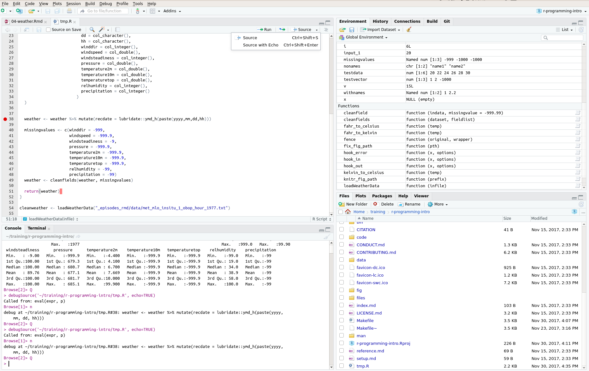

In the previous episodes we showed how to create functions, and test that they are working.  In this episode we will use these ideas, and expand on them to load the weather data that you downloaded at the start of the course.   In your project's `data` folder you will see that there are a series of weather data files, named
`met_mlo_insitu_1_obop_hour_yyyy.txt`, where `yyyy` is the year.  There is also a file, `met_README` which explains the format of the data files. Section 5.3 of this file contains information for the files we will be loading.    Take a look at this section now.  In contrast to the CO2 data, where all missing data was represented by `-999.99`, it looks like the missing value for some fields in the weather data are different.  

Fortunately, we used the `...` argument in our `cleanfields()` function so that we can override the default for the `missingvalue` argument.

[Download the file `loadWeather.R`]({{ page.root }}/data/src/loadWeather.R), and copy this to your `src/` director.  The file contains a function that takes a filename as its input argument and loads the weather data contained in that file.  FIXME - screenshots and zip file. It also generates a field containing the date and time of each observation, stored as a `datetime`.  It returns a tibble containing the loaded weather data.  During this episode we will modify the function to clean the data.  

In the next episode we will write a function to load multiple years of weather data.  

We'll also spend some time on how to debug your program.  Although this may seem somewhat pessimistic, the
reality is that nobody's code works first time.  By learning about the tools needed to debug our code we
can save ourselves a great deal of time and frustration.

> ## Challenge: What do we need to do?
> 
> With the person sat next to you, discuss the process we will need to go through to load and clean all of the 
> files, and output a single tibble containing all their contents.  Don't worry if you don't know how to 
> do all of these tasks in R; the important thing is to think about how we might break the process down into
> smaller chunks.  We can then write a function for each of these chunks, to produce our finished loading process. 
> You may realise that we already have functions that (almost) do what we need for some of these tasks.
> 
> > ## Solution
> > 
> > * We will need to process each file in turn.  We know how to loop over a vector of values, using a `for` loop.  We don't *yet* know how to list a series of files that match a pattern
> > 
> > In each file:
> > 
> > * We will need to load the data into a tibble.  `readr` comes with lots of functions to do this; we can
> > use `read_table()` as we did with the CO2 data (although the parameters we use will need to be modified as the 
> > variables contained in the data are different).
> > * We will need to clean the data.  We have a function that will do this for a single field, with an arbitrary special value to represent "missing".  Our function to handle more than one field doesn't let us specify anything other than the default missing value from our CO2 data.  But we may be able to extend this function.  
> > * We will need to handle the date and time fields in the data.  We used `lubridate`'s `ymd()` function to 
> > do this with the CO2 data. So we're part way there on this
> > * It would be a good idea to validate the data.  For example, precipitation should be `>=0`, the wind direction 
> > should be between 0 and 359 degrees.
> > 
> > We will also need to know how combine the weather files that we have loaded into a single file.
> > 
> {: .solution}
{: .challenge}

> ## Challenge: Cleaning the weather data
> 
> Modify the provided `loadWeatherData()` function to clean the data fields, using the values to represent
> missing data provided in `met_README`.  Hint:  You will need to call `cleanfields()` once for each distinct
> mising value.  
> > ## Solution
> > 
> > 
> > ~~~
> > loadWeatherData <- function(infile){
> >   # Load the weather data stored in infile to a tibble, and return it
> >   weather <- read_table(infile,
> >                         col_names = c("obs",
> >                                       "yyyy",
> >                                       "mm",
> >                                       "dd",
> >                                       "hh",
> >                                       "winddir",
> >                                       "windspeed",
> >                                       "windsteadiness",
> >                                       "pressure",
> >                                       "temperature2m",
> >                                       "temperature10m",
> >                                       "temperaturetop",
> >                                       "relhumidity",
> >                                       "precipitation" ),
> >                         col_types = cols(
> >                           obs = col_character(),
> >                           yyyy = col_integer(),
> >                           mm = col_character(),
> >                           dd = col_character(),
> >                           hh = col_character(),
> >                           winddir = col_integer(),
> >                           windspeed = col_double(),
> >                           windsteadiness = col_integer(),
> >                           pressure = col_double(),
> >                           temperature2m = col_double(),
> >                           temperature10m = col_double(),
> >                           temperaturetop = col_double(),
> >                           relhumidity = col_integer(),
> >                           precipitation = col_integer()
> >                         )
> >   )
> >   
> >   #  Generate recdate field
> >   weather <- weather %>% mutate(recdate = lubridate::ymd_h(paste(yyyy,mm,dd,hh)))
> >   
> >   # Clean missing values, using values specified in met_README
> >   weather <- cleanfields(weather, c("windspeed", "pressure", "temperature2m",
> >                                     "temperature10m", "temperaturetop"), missingvalue = -999.9)
> >   weather <- cleanfields(weather, "winddir", missingvalue = -999)
> >   weather <- cleanfields(weather, "windsteadiness", missingvalue = -9)
> >   weather <- cleanfields(weather, c("relhumidity", "precipitation"), missingvalue = -99)
> >   
> >   return(weather)
> >   
> > }
> > 
> > cleanweather <- loadWeatherData("data/met_mlo_insitu_1_obop_hour_1977.txt")
> > ~~~
> > {: .language-r}
> > 
> > There is some repetition in our code; we call the `cleanfields()` function four times.  This isn't ideal,
> > but as the function is written we can only pass one value that represents missing at a time.
> > 
> {: .solution}
{: .challenge}

## Checking our load has worked

The `summary()` function will show us summary statistics for each variable in a data-set.  Let's use this to
check that our data looks reasonable:
The summary shows that some variables, e.g. `winddir` have large, positive values:

~~~
summary(cleanweather)
~~~
{: .language-r}

~~~
     obs                 yyyy           mm                 dd           
 Length:8760        Min.   :1977   Length:8760        Length:8760       
 Class :character   1st Qu.:1977   Class :character   Class :character  
 Mode  :character   Median :1977   Mode  :character   Mode  :character  
                    Mean   :1977                                        
                    3rd Qu.:1977                                        
                    Max.   :1977                                        
                                                                        
      hh               winddir        windspeed     windsteadiness
 Length:8760        Min.   :  0.0   Min.   : 0.00   Min.   :100   
 Class :character   1st Qu.:120.0   1st Qu.: 2.70   1st Qu.:100   
 Mode  :character   Median :170.0   Median : 4.50   Median :100   
                    Mean   :229.9   Mean   :11.78   Mean   :100   
                    3rd Qu.:270.0   3rd Qu.: 7.60   3rd Qu.:100   
                    Max.   :999.0   Max.   :99.90   Max.   :100   
                                                    NA's   :823   
    pressure     temperature2m    temperature10m temperaturetop
 Min.   :673.9   Min.   :-4.400   Mode:logical   Mode:logical  
 1st Qu.:679.3   1st Qu.: 4.100   NA's:8760      NA's:8760     
 Median :680.7   Median : 6.700                                
 Mean   :680.5   Mean   : 7.669                                
 3rd Qu.:681.7   3rd Qu.:10.000                                
 Max.   :685.1   Max.   :99.900                                
 NA's   :18                                                    
  relhumidity     precipitation     recdate                   
 Min.   :  7.00   Mode:logical   Min.   :1977-01-01 00:00:00  
 1st Qu.: 20.00   NA's:8760      1st Qu.:1977-04-02 05:45:00  
 Median : 34.00                  Median :1977-07-02 11:30:00  
 Mean   : 40.79                  Mean   :1977-07-02 11:30:00  
 3rd Qu.: 58.00                  3rd Qu.:1977-10-01 17:15:00  
 Max.   :100.00                  Max.   :1977-12-31 23:00:00  
 NA's   :118                                                  
~~~
{: .output}

It looks like the cleaning process hasn't worked properly!   We've tested our `cleanfields()` function, so we can be reasonably confident that is working properly (although it's possible that something has gone wrong that we *haven't* tested for).  So what's going on?

## Hunting bugs

Hunting a bug down can be very difficult.   They're often "obvious" once you've found them (it's often the case that the more "obvious" the bug the longer it takes to find).  There are a number of techniques we can use to help us:

* We can print out statements (using `print()` so we know which bits of code are being run)
* We can use a debugger to pause the program execution and look at the values of variables _within_ the function

Take a look at our `loadWeatherData()` function; it does two main things: loads the data and cleans it (it also creates the `recdate` field - but that looks OK in our summary).  We'd like to know what the `weather` tibble looks like once we've read it in, but _before_ we've cleaned it - we can use this to help work out whether the problem is with the data itself (i.e. the file doesn't conform to the specificiation), our loading the data or our cleaning of the data.

Find the line in your code where we generate the `recdate` field, and click to the left of the line number, as shown below:  You should find a red circle appears next to the line.  This creates a breakpoint.  If we run the code again, 

When we run the code again, by pressing <kbd>Ctrl</kbd>+<kbd>Shift</kbd>+<kbd>Enter</kbd>, it will stop on the selected line _before it is executed_.  We can look at the contents of the weather tibble by entering its name in the console window.  

> ## Challenge
> 
> Use the `summary()` function (or other methods of your choice) to work out whether the problem is with our cleaning function or with what's being read in.  If there are problems with what's being read in, find a record which appears to be incorrect (perhaps uing, `filter()`).  Take a look at the raw data-file to establish whether the problem is with our _reading in_ of the data, or the data itself.
> 
> > ## Solution
> > 
> >  Within the debugger, setting a breakpoint as described in the text, 
> >  we obtain:
> > 
> > 
> > 
> > 
> > ~~~
> > summary(weather)
> > ~~~
> > {: .language-r}
> > 
> > 
> > 
> > ~~~
> >      obs                 yyyy           mm                 dd           
> >  Length:8760        Min.   :1977   Length:8760        Length:8760       
> >  Class :character   1st Qu.:1977   Class :character   Class :character  
> >  Mode  :character   Median :1977   Mode  :character   Mode  :character  
> >                     Mean   :1977                                        
> >                     3rd Qu.:1977                                        
> >                     Max.   :1977                                        
> >       hh               winddir        windspeed     windsteadiness  
> >  Length:8760        Min.   :  0.0   Min.   : 0.00   Min.   : -9.00  
> >  Class :character   1st Qu.:120.0   1st Qu.: 2.70   1st Qu.:100.00  
> >  Mode  :character   Median :170.0   Median : 4.50   Median :100.00  
> >                     Mean   :229.9   Mean   :11.78   Mean   : 89.76  
> >                     3rd Qu.:270.0   3rd Qu.: 7.60   3rd Qu.:100.00  
> >                     Max.   :999.0   Max.   :99.90   Max.   :100.00  
> >     pressure      temperature2m    temperature10m   temperaturetop  
> >  Min.   :-999.9   Min.   :-4.400   Min.   :-999.9   Min.   :-999.9  
> >  1st Qu.: 679.3   1st Qu.: 4.100   1st Qu.:-999.9   1st Qu.:-999.9  
> >  Median : 680.7   Median : 6.700   Median :-999.9   Median :-999.9  
> >  Mean   : 677.1   Mean   : 7.669   Mean   :-999.9   Mean   :-999.9  
> >  3rd Qu.: 681.7   3rd Qu.:10.000   3rd Qu.:-999.9   3rd Qu.:-999.9  
> >  Max.   : 685.1   Max.   :99.900   Max.   :-999.9   Max.   :-999.9  
> >   relhumidity    precipitation
> >  Min.   :-99.0   Min.   :-99  
> >  1st Qu.: 19.0   1st Qu.:-99  
> >  Median : 34.0   Median :-99  
> >  Mean   : 38.9   Mean   :-99  
> >  3rd Qu.: 58.0   3rd Qu.:-99  
> >  Max.   :100.0   Max.   :-99  
> > ~~~
> > {: .output}
> > 
> > As we're looking at the data _before_ cleaning it, we see the large negative values that are used to represent missing data.
> > We also see that some variables have the large positive values we saw before, such as the maximum value of `winddir` being 999.  We *know* that this is incorrect, since it represents a direction in degrees, and so should be <=360.  This suggests the problem is with our loading of the data, or the data itself. We can find a problematic record
> > by filtering the tibble:
> > 
> > 
> > ~~~
> > weather %>% filter(winddir == 999)
> > ~~~
> > {: .language-r}
> > 
> > 
> > 
> > ~~~
> > # A tibble: 631 x 14
> >      obs  yyyy    mm    dd    hh winddir windspeed windsteadiness pressure
> >    <chr> <int> <chr> <chr> <chr>   <int>     <dbl>          <int>    <dbl>
> >  1   MLO  1977    02    17    18     999      99.9             -9    679.0
> >  2   MLO  1977    02    18    05     999      99.9             -9    678.6
> >  3   MLO  1977    02    18    08     999      99.9             -9    680.3
> >  4   MLO  1977    02    18    14     999      99.9             -9    678.6
> >  5   MLO  1977    02    20    04     999      99.9             -9    682.0
> >  6   MLO  1977    02    20    05     999      99.9             -9    682.4
> >  7   MLO  1977    02    20    06     999      99.9             -9    682.7
> >  8   MLO  1977    02    20    07     999      99.9             -9    682.7
> >  9   MLO  1977    02    20    08     999      99.9             -9    682.7
> > 10   MLO  1977    02    20    09     999      99.9             -9    682.7
> > # ... with 621 more rows, and 5 more variables: temperature2m <dbl>,
> > #   temperature10m <dbl>, temperaturetop <dbl>, relhumidity <int>,
> > #   precipitation <int>
> > ~~~
> > {: .output}
> > 
> > Let's look at the data file:
> > 
> > 
> > ~~~
> > MLO 1977 02 17 18 -999 -99.9  -9  679.00    7.2 -999.9 -999.9  17 -99
> > ~~~
> > {: .language-r}
> > 
> > The data look like they are correct; the "missing" values are negative; something has gone wrong with how we're reading in the data.
> > 
> {: .solution}
{: .challenge}

In the challenge we deduced that the issue was with how the `read_table()` function is reading the data in.  

Take a look a the help file for `read_table()` - it shows that there is also a function `read_table2()`, which "is like read.table(), [but] it allows any number of whitespace characters between columns, and the lines can be of different lengths."

Let's try this:

~~~
loadWeatherData <- function(infile){
  # Load the weather data stored in infile to a tibble, and return it
  weather <- read_table2(infile,
                        col_names = c("obs",
                                      "yyyy",
                                      "mm",
                                      "dd",
                                      "hh",
                                      "winddir",
                                      "windspeed",
                                      "windsteadiness",
                                      "pressure",
                                      "temperature2m",
                                      "temperature10m",
                                      "temperaturetop",
                                      "relhumidity",
                                      "precipitation" ),
                        col_types = cols(
                          obs = col_character(),
                          yyyy = col_integer(),
                          mm = col_character(),
                          dd = col_character(),
                          hh = col_character(),
                          winddir = col_integer(),
                          windspeed = col_double(),
                          windsteadiness = col_integer(),
                          pressure = col_double(),
                          temperature2m = col_double(),
                          temperature10m = col_double(),
                          temperaturetop = col_double(),
                          relhumidity = col_integer(),
                          precipitation = col_integer()
                        )
  )
  
  #  Generate recdate field
  weather <- weather %>% mutate(recdate = lubridate::ymd_h(paste(yyyy,mm,dd,hh)))
  
  # Clean missing values, using values specified in met_README
  weather <- cleanfields(weather, c("windspeed", "pressure", "temperature2m",
                                    "temperature10m", "temperaturetop"), missingvalue = -999.9)
  weather <- cleanfields(weather, "winddir", missingvalue = -999)
  weather <- cleanfields(weather, "windsteadiness", missingvalue = -9)
  weather <- cleanfields(weather, c("relhumidity", "precipitation"), missingvalue = -99)
  
  return(weather)
  
}

cleanweather <- loadWeatherData("data/met_mlo_insitu_1_obop_hour_1977.txt")
summary(cleanweather)
~~~
{: .language-r}

~~~
     obs                 yyyy           mm                 dd           
 Length:8760        Min.   :1977   Length:8760        Length:8760       
 Class :character   1st Qu.:1977   Class :character   Class :character  
 Mode  :character   Median :1977   Mode  :character   Mode  :character  
                    Mean   :1977                                        
                    3rd Qu.:1977                                        
                    Max.   :1977                                        
                                                                        
      hh               winddir        windspeed       windsteadiness
 Length:8760        Min.   :  0.0   Min.   :-99.900   Min.   :100   
 Class :character   1st Qu.:110.0   1st Qu.:  2.200   1st Qu.:100   
 Mode  :character   Median :160.0   Median :  4.000   Median :100   
                    Mean   :170.2   Mean   : -2.615   Mean   :100   
                    3rd Qu.:230.0   3rd Qu.:  6.300   3rd Qu.:100   
                    Max.   :360.0   Max.   : 19.200   Max.   :100   
                    NA's   :631                       NA's   :823   
    pressure     temperature2m    temperature10m temperaturetop
 Min.   :673.9   Min.   :-4.400   Mode:logical   Mode:logical  
 1st Qu.:679.3   1st Qu.: 4.000   NA's:8760      NA's:8760     
 Median :680.7   Median : 6.700                                
 Mean   :680.5   Mean   : 6.926                                
 3rd Qu.:681.7   3rd Qu.: 9.600                                
 Max.   :685.1   Max.   :17.400                                
 NA's   :18      NA's   :70                                    
  relhumidity     precipitation     recdate                   
 Min.   :  7.00   Mode:logical   Min.   :1977-01-01 00:00:00  
 1st Qu.: 20.00   NA's:8760      1st Qu.:1977-04-02 05:45:00  
 Median : 34.00                  Median :1977-07-02 11:30:00  
 Mean   : 40.79                  Mean   :1977-07-02 11:30:00  
 3rd Qu.: 58.00                  3rd Qu.:1977-10-01 17:15:00  
 Max.   :100.00                  Max.   :1977-12-31 23:00:00  
 NA's   :118                                                  
~~~
{: .output}

This looks much better, with the exception of the windspeed data, which has `-99.9` as its minimum.  If we check back to the original data, it looks like they are using this as their "missing" value for windspeed, and not `-999.9` as it says in the README.

> ## Challenge:  Our final loading function
> 
> Modify your `loadWeatherData()` function so that it uses `read_table2()` and uses the correct
> value for the missing wind speeds.   You should make sure you put a comment in your function
> explaining why this is _different_ to the missing value specified in the README.  Check your data 
> look sensible using the `summary()` function
> 
> > ## Solution
> > 
> > 
> > ~~~
> > loadWeatherData <- function(infile){
> >   # Load the weather data stored in infile to a tibble, and return it
> >   weather <- read_table2(infile,
> >                         col_names = c("obs",
> >                                       "yyyy",
> >                                       "mm",
> >                                       "dd",
> >                                       "hh",
> >                                       "winddir",
> >                                       "windspeed",
> >                                       "windsteadiness",
> >                                       "pressure",
> >                                       "temperature2m",
> >                                       "temperature10m",
> >                                       "temperaturetop",
> >                                       "relhumidity",
> >                                       "precipitation" ),
> >                         col_types = cols(
> >                           obs = col_character(),
> >                           yyyy = col_integer(),
> >                           mm = col_character(),
> >                           dd = col_character(),
> >                           hh = col_character(),
> >                           winddir = col_integer(),
> >                           windspeed = col_double(),
> >                           windsteadiness = col_integer(),
> >                           pressure = col_double(),
> >                           temperature2m = col_double(),
> >                           temperature10m = col_double(),
> >                           temperaturetop = col_double(),
> >                           relhumidity = col_integer(),
> >                           precipitation = col_integer()
> >                         )
> >   )
> >   
> >   #  Generate recdate field
> >   weather <- weather %>% mutate(recdate = lubridate::ymd_h(paste(yyyy,mm,dd,hh)))
> >   
> >   # Clean missing values, using values specified in met_README
> >   weather <- cleanfields(weather, c("pressure", "temperature2m",
> >                                     "temperature10m", "temperaturetop"), missingvalue = -999.9)
> >   
> >   weather <- cleanfields(weather, "windspeed", missingvalue = -99.9) # Was given as -999.9 in met_README
> >   weather <- cleanfields(weather, "winddir", missingvalue = -999)
> >   weather <- cleanfields(weather, "windsteadiness", missingvalue = -9)
> >   weather <- cleanfields(weather, c("relhumidity", "precipitation"), missingvalue = -99)
> >   
> >   return(weather)
> >   
> > }
> > 
> > cleanweather <- loadWeatherData("data/met_mlo_insitu_1_obop_hour_1977.txt")
> > summary(cleanweather)
> > ~~~
> > {: .language-r}
> > 
> > 
> > 
> > ~~~
> >      obs                 yyyy           mm                 dd           
> >  Length:8760        Min.   :1977   Length:8760        Length:8760       
> >  Class :character   1st Qu.:1977   Class :character   Class :character  
> >  Mode  :character   Median :1977   Mode  :character   Mode  :character  
> >                     Mean   :1977                                        
> >                     3rd Qu.:1977                                        
> >                     Max.   :1977                                        
> >                                                                         
> >       hh               winddir        windspeed      windsteadiness
> >  Length:8760        Min.   :  0.0   Min.   : 0.000   Min.   :100   
> >  Class :character   1st Qu.:110.0   1st Qu.: 2.700   1st Qu.:100   
> >  Mode  :character   Median :160.0   Median : 4.000   Median :100   
> >                     Mean   :170.2   Mean   : 4.937   Mean   :100   
> >                     3rd Qu.:230.0   3rd Qu.: 6.700   3rd Qu.:100   
> >                     Max.   :360.0   Max.   :19.200   Max.   :100   
> >                     NA's   :631     NA's   :631      NA's   :823   
> >     pressure     temperature2m    temperature10m temperaturetop
> >  Min.   :673.9   Min.   :-4.400   Mode:logical   Mode:logical  
> >  1st Qu.:679.3   1st Qu.: 4.000   NA's:8760      NA's:8760     
> >  Median :680.7   Median : 6.700                                
> >  Mean   :680.5   Mean   : 6.926                                
> >  3rd Qu.:681.7   3rd Qu.: 9.600                                
> >  Max.   :685.1   Max.   :17.400                                
> >  NA's   :18      NA's   :70                                    
> >   relhumidity     precipitation     recdate                   
> >  Min.   :  7.00   Mode:logical   Min.   :1977-01-01 00:00:00  
> >  1st Qu.: 20.00   NA's:8760      1st Qu.:1977-04-02 05:45:00  
> >  Median : 34.00                  Median :1977-07-02 11:30:00  
> >  Mean   : 40.79                  Mean   :1977-07-02 11:30:00  
> >  3rd Qu.: 58.00                  3rd Qu.:1977-10-01 17:15:00  
> >  Max.   :100.00                  Max.   :1977-12-31 23:00:00  
> >  NA's   :118                                                  
> > ~~~
> > {: .output}
> > 
> {: .solution}
{: .challenge} 

It (finally) looks like we've read the data in successfully.   

Although this has been quite a protracted
episode it highlights some of the typical problems you will come accross when dealing with real-life data.  We've spent a lot of time on looking at how to work out what's gone wrong, and how to fix it, using a combination of testing and debugging.   It's quite normal to spend a lot of time on these aspects of programming; this is fine.

