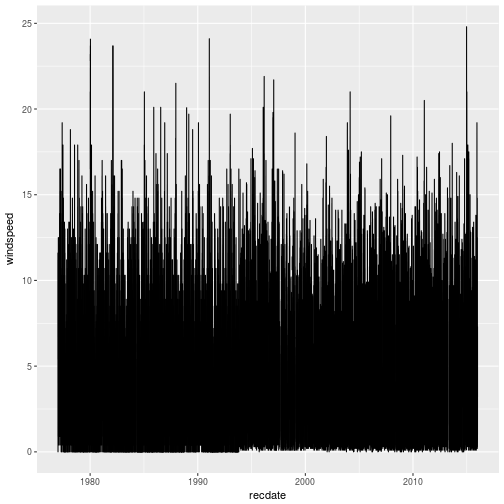
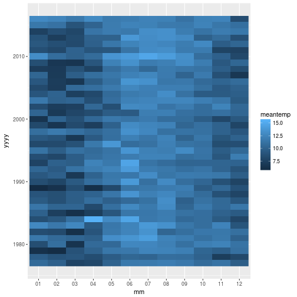
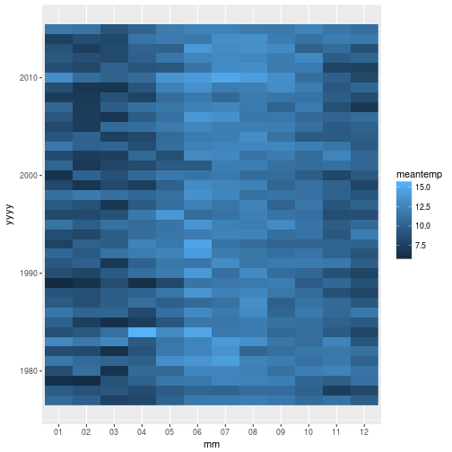

## Loading more than one file at once

We have many years of weather data, and we would like to load them into a single tibble.  We can modify our `loadWeatherData()` function to do this.  

We already know how to iterate over a vector using a `for` loop.  Let's make an example vector by hand, while we develop the function:

~~~
weatherfiles <- c("data/met_mlo_insitu_1_obop_hour_1977.txt", "data/met_mlo_insitu_1_obop_hour_1978.txt", "data/met_mlo_insitu_1_obop_hour_1979.txt")
~~~
{: .r}

This is what we want our function to do::

~~~
loadWeatherDataPseudoCode <- function(weatherfiles){
  for (f in weatherfiles) {
    print(paste("Load in data for file", f))
    print("Append the data to the data we've already loaded")
  }
  print("return the tibble containing all the data")
}

loadWeatherDataPseudoCode(weatherfiles)
~~~
{: .r}

~~~
[1] "Load in data for file data/met_mlo_insitu_1_obop_hour_1977.txt"
[1] "Append the data to the data we've already loaded"
[1] "Load in data for file data/met_mlo_insitu_1_obop_hour_1978.txt"
[1] "Append the data to the data we've already loaded"
[1] "Load in data for file data/met_mlo_insitu_1_obop_hour_1979.txt"
[1] "Append the data to the data we've already loaded"
[1] "return the tibble containing all the data"
~~~
{: .output}

## Create a new function or modify an existing one?

We could decide to create a new function which would call `loadWeatherData()` for each file,
rather than modifying our existing function.  There are pros and cons to extending the existing
function, or creating a new one.  MORE HERE - ease of debugging vs single file is just file vector 
with length 1

{: .callout}

~~~
loadWeatherData <- function(infiles){
  # Load in a weather data file
  
  for (infile in infiles) {  
    weather <- read_table(infile,
                          col_names = c("obs",
                                        "yyyy",
                                        "mm",
                                        "dd",
                                        "hh",
                                        "winddir",
                                        "windspeed",
                                        "windsteadiness",
                                        "pressure",
                                        "temperature2m",
                                        "temperature10m",
                                        "temperaturetop",
                                        "relhumidity",
                                        "precipitation" ),
                          col_types = cols(
                            obs = col_character(),
                            yyyy = col_integer(),
                            mm = col_character(),
                            dd = col_character(),
                            hh = col_character(),
                            winddir = col_integer(),
                            windspeed = col_double(),
                            windsteadiness = col_integer(),
                            pressure = col_double(),
                            temperature2m = col_double(),
                            temperature10m = col_double(),
                            temperaturetop = col_double(),
                            relhumidity = col_integer(),
                            precipitation = col_integer()
                          )
    )
    
    
    weather <- weather %>% mutate(recdate = lubridate::ymd_h(paste(yyyy,mm,dd,hh)))
    
    missingvalues <- c(winddir = -999,
                       windspeed = -999.9,
                       windsteadiness = -9,
                       pressure = -999.9,
                       temperature2m = -999.9,
                       temperature10m = -999.9,
                       temperaturetop = -999.9,
                       relhumidity = -99,
                       precipitation = -99)
    weather <- cleanfields(weather, missingvalues)
  }
  return(weather)
}
~~~
{: .r}

~~~
cleanweather <- loadWeatherData(weatherfiles)
~~~
{: .r}

That looks like it's worked; but what does our `cleanweather` data set contain?

~~~
cleanweather %>%  
  group_by(yyyy) %>% 
  count()  
~~~
{: .r}

~~~
# A tibble: 1 x 2
# Groups:   yyyy [1]
   yyyy     n
  <int> <int>
1  1979  8760
~~~
{: .output}

We only have data for the most recent year that we read in.  This is because the `weather` data-set gets overwritten each time we run through the `for` loop.  Let's modify the function so that we append the current year's data to a tibble that we define out of the loop.

**This is a really bad thing to do in R - should make a list and bind togeher**

~~~
loadWeatherData <- function(infiles){
  # Load in a weather data file
  allweather <- NULL
  for (infile in infiles) {  
    weather <- read_table2(infile,
                          col_names = c("obs",
                                        "yyyy",
                                        "mm",
                                        "dd",
                                        "hh",
                                        "winddir",
                                        "windspeed",
                                        "windsteadiness",
                                        "pressure",
                                        "temperature2m",
                                        "temperature10m",
                                        "temperaturetop",
                                        "relhumidity",
                                        "precipitation" ),
                          col_types = cols(
                            obs = col_character(),
                            yyyy = col_integer(),
                            mm = col_character(),
                            dd = col_character(),
                            hh = col_character(),
                            winddir = col_integer(),
                            windspeed = col_double(),
                            windsteadiness = col_integer(),
                            pressure = col_double(),
                            temperature2m = col_double(),
                            temperature10m = col_double(),
                            temperaturetop = col_double(),
                            relhumidity = col_integer(),
                            precipitation = col_integer()
                          )
    )
    
    
    weather <- weather %>% mutate(recdate = lubridate::ymd_h(paste(yyyy,mm,dd,hh)))
    
    missingvalues <- c(winddir = -999,
                       windspeed = -99.9, 
                       windsteadiness = -9,
                       pressure = -999.9,
                       temperature2m = -999.9,
                       temperature10m = -999.9,
                       temperaturetop = -999.9,
                       relhumidity = -99,
                       precipitation = -99)
    weather <- cleanfields(weather, missingvalues)
    
    
    
    
    allweather <- bind_rows(allweather, weather)
  }
  return(allweather)
}
~~~
{: .r}

~~~
cleanweather <- loadWeatherData(weatherfiles)
~~~
{: .r}

~~~
cleanweather %>%  
  group_by(yyyy) %>% 
  count()  
~~~
{: .r}

~~~
# A tibble: 3 x 2
# Groups:   yyyy [3]
   yyyy     n
  <int> <int>
1  1977  8760
2  1978  8760
3  1979  8760
~~~
{: .output}

So we can now pass more than one file to our `loadWeatherData` function.   Rather than type all the files in, we
can use the `list.files()` function to generate the vector of filenames:

~~~
weatherfiles <- list.files(path="./data", "met_mlo_ins*",full.names=TRUE)
cleanweather <- loadWeatherData(weatherfiles)
~~~
{: .r}

~~~
summary(cleanweather)
~~~
{: .r}

~~~
     obs                 yyyy           mm                 dd           
 Length:341838      Min.   :1977   Length:341838      Length:341838     
 Class :character   1st Qu.:1986   Class :character   Class :character  
 Mode  :character   Median :1996   Mode  :character   Mode  :character  
                    Mean   :1996                                        
                    3rd Qu.:2006                                        
                    Max.   :2015                                        
                                                                        
      hh               winddir        windspeed      windsteadiness  
 Length:341838      Min.   :  0.0   Min.   : 0.000   Min.   :  0.00  
 Class :character   1st Qu.:126.0   1st Qu.: 2.200   1st Qu.: 97.00  
 Mode  :character   Median :166.0   Median : 3.900   Median :100.00  
                    Mean   :177.7   Mean   : 4.566   Mean   : 96.56  
                    3rd Qu.:236.0   3rd Qu.: 6.300   3rd Qu.:100.00  
                    Max.   :360.0   Max.   :24.800   Max.   :285.00  
                    NA's   :11124   NA's   :11114    NA's   :12981   
    pressure     temperature2m    temperature10m   temperaturetop  
 Min.   :666.1   Min.   :-5.500   Min.   :-3.90    Min.   :-3.60   
 1st Qu.:679.3   1st Qu.: 4.500   1st Qu.: 5.60    1st Qu.: 5.90   
 Median :680.5   Median : 7.000   Median : 7.50    Median : 7.70   
 Mean   :680.3   Mean   : 7.277   Mean   : 7.52    Mean   : 7.56   
 3rd Qu.:681.7   3rd Qu.:10.000   3rd Qu.: 9.50    3rd Qu.: 9.40   
 Max.   :686.4   Max.   :21.000   Max.   :18.40    Max.   :16.70   
 NA's   :9174    NA's   :10630    NA's   :163053   NA's   :159106  
  relhumidity     precipitation       recdate                   
 Min.   :  1.00   Min.   :  0.00   Min.   :1977-01-01 00:00:00  
 1st Qu.: 15.00   1st Qu.:  0.00   1st Qu.:1986-10-01 19:15:00  
 Median : 30.00   Median :  0.00   Median :1996-07-01 14:30:00  
 Mean   : 37.64   Mean   :  0.05   Mean   :1996-07-01 14:50:57  
 3rd Qu.: 58.00   3rd Qu.:  0.00   3rd Qu.:2006-04-01 09:45:00  
 Max.   :101.00   Max.   :180.00   Max.   :2015-12-31 23:00:00  
 NA's   :29157    NA's   :94003                                 
~~~
{: .output}

~~~
cleanweather %>% 
  ggplot(aes(x=recdate, y=windspeed)) + geom_line()
~~~
{: .r}

~~~
cleanweather %>% 
  ggplot(aes(x=recdate, y=temperature2m)) + geom_line()
~~~
{: .r}

~~~
cleanweather %>% 
  filter(hh == "15") %>% 
  group_by(yyyy,mm) %>% 
  summarise(meantemp = mean(temperature2m, na.rm=TRUE)) %>% 
  ggplot(aes(x=mm,y=yyyy,fill=meantemp)) + geom_raster()
~~~
{: .r}

