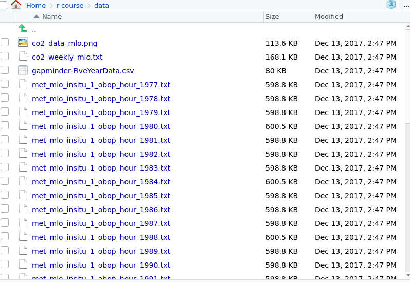
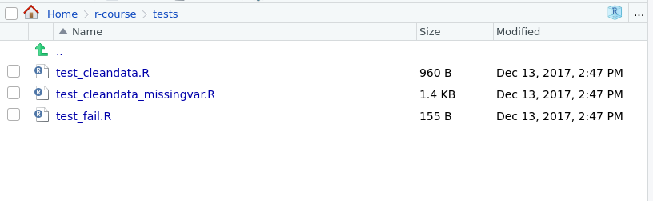

```{r, include=FALSE}
source("../bin/chunk-options.R")
knitr_fig_path("01-")
```

## Introduction 

The aim of this course is to teach you programming techniques using R.  We use the example of loading and analysing historic CO<sub>2</sub> and temperature data to illustrate these techniques.  We spend more time than is usual on dealing with _problems_.   Many tutorials assume everything works first time, and don't explain how to debug and test your code.   The reality is that we all spend a great deal of time dealing with imperfectly formatted data and bugs.  By explaining how to debug and deal with these issues efficiently you will save time and frustration.

The other University of Manchester R course,  [Data Analysis Using R](https://uomresearchit.github.io/r-tidyverse-intro/) covers:

  *  Introduction to R and R Studio
  *  Getting help
  *  Loading data into R
  *  Transforming and cleaning data
  *  Plotting data
  *  Finding and using packages

This episode briefly recaps some of these topics.  We will use the data introduced in this section in the remainder of the course.

The "Data Analysis Using R" course made extensive use of the tidyverse.  This is a collection of packages that have been designed to work well together, and which provide an integrated way of performing data analyses.  They also hide some of the complexity underlying "base" R.    When we come to program with R, we will need to explore some of this complexity.

##  Getting started with R

R Studio is a widely used integrated development environment for R. We will use R Studio for the remainder of today's lesson.  This course assumes you already have some familiarity with R (the [Research IT](http://www.itservices.manchester.ac.uk/research/) course, [Data Analysis Using R](https://uomresearchit.github.io/r-tidyverse-intro/) covers the necessary material).   As a refresher we will briefly go through the process of loading and manipulating some data.  We will also introduce some of the data structures and functions that we will be using in the rest of the course.

We will be using R Studio in the course; it provides a much nicer environment for using R than the default command line version.  R Studio lets us use _projects_ to keep our data and analysis scripts together.

## Challenge: Creating a new project

Create a new project for today's course.  It is up to you what you call the project, (`r-course` would be a sensible option), but avoid putting spaces in the project name.  If you are using a university PC, you should creat the project within the `C:\Work` directory on your machine's local disk. 

At lunchtime and the end of the day copy your project directory to your P drive, so that you can refer your work later, and on other machines.  There are sometimes transient problems connecting to the P drive; if connectivity is lost your RStudio session will appear to hang.  For this reason we suggest you don't work with your project on the P drive.

Within your project director create a folder called `src`.  We will use this to store the R scripts that you write.  Download the course data from [here]({{ page.root }}/data/data.zip).  The zip file contains `data` and `tests` folders.  Copy these (and their contents) to the project directory. 

## Solution: Creating a new project

Your project directory should look like this:


The `src` directory should be empty.

The `data` directory should contain the required data files:



The `tests` directory should contain some `.R` files; we will use these later.



If your directories do not look like this, _please_ use your red sticky to get help from one of the helpers.

When you create a new project R Studio should set your working directory to the project's directory. The current working directory is shown in grey above the console.  If this is not the case please get help from one of the helpers.

{: .solution}
{: .challenge}


> ## Version Control
> 
> It is always a good idea to use version control with your projects.  
> This makes it easy to undo changes to your code, scripts and documents, and to collaborate with others. 
> We don't cover version control in this course, however [Research IT offers a course on using git](http://app.manchester.ac.uk/RGIT)
> (logon required). [Git](https://git-scm.com/) is a popular version control system, 
> that integrates well with R Studio.  Git makes collaboration with others easy when it is used in 
> conjunction with [GitHub](https://www.github.com).
{: .callout}


## Loading data into R

Although R contains functions to load data into it, we used the tidyverse equivalents in the previous course.   We loaded CSV data using the `read_csv()` function.  For example, to load the `gapminder` data we used in the [R for data analysis course](https://uomresearchit.github.io/r-tidyverse-intro/):

```{r}
library(tidyverse)
gapminder <- read_csv(file = "data/gapminder-FiveYearData.csv",
                      col_types = cols(
                        country = col_character(),
                        year = col_integer(),
                        pop = col_double(),
                        continent = col_character(),
                        lifeExp = col_double(),
                        gdpPercap = col_double()
                      ) )

```

We explicitly list the column type of each variable in order to improve the robustness of our code.

> ## Guessing column types
>
> You don't need to type all the column types out by hand.  If you run `read_csv()` without
> the `col_types` argument, it will display a list of the column types it guessed in the console.
> this list can be copy and pasted into your script, and modified if required.
> 
{: .callout}

> ## read.csv() vs read_csv()
>
> R comes with a function `read.csv()` that will load CSV files.  `read_csv()` is part of the `readr` package,
> which is part of the tidyverse.  We use `read_csv()` because it doesn't automatically convert strings to factors,
> has a more robust way of specifying the type of data in each columns, and because it is quicker at reading files than
> `read.csv()`.  `read.csv()` returns a data frame; in contrast `read_csv()` returns a tibble.  This is the tidyverse's 
> equivalent of a data frame.   Tibbles behave similarly to data frames, but handle some of the annoyances with them.  For 
> full details see `vignette("tibble")`
{: .callout}


Let's take a look at the CO<sub>2</sub> data we will be using in this episode.  This in the `data/` directory, and called `co2_weekly_mlo.txt`.  You can preview the file by selecting it in the `Files` tab of RStudio (or using, e.g. Notepad++):

```
# --------------------------------------------------------------------
# USE OF NOAA ESRL DATA
# 
# These data are made freely available to the public and the
# scientific community in the belief that their wide dissemination
# will lead to greater understanding and new scientific insights.
# The availability of these data does not constitute publication
# of the data.  NOAA relies on the ethics and integrity of the user to
# insure that ESRL receives fair credit for their work.  If the data 
# are obtained for potential use in a publication or presentation, 
# ESRL should be informed at the outset of the nature of this work.  
# If the ESRL data are essential to the work, or if an important 
# result or conclusion depends on the ESRL data, co-authorship
# may be appropriate.  This should be discussed at an early stage in
# the work.  Manuscripts using the ESRL data should be sent to ESRL
# for review before they are submitted for publication so we can
# insure that the quality and limitations of the data are accurately
# represented.
# 
# Contact:   Pieter Tans (303 497 6678; pieter.tans@noaa.gov)
# 
# File Creation:  Sun Mar  5 05:01:22 2017
# 
# RECIPROCITY
# 
# Use of these data implies an agreement to reciprocate.
# Laboratories making similar measurements agree to make their
# own data available to the general public and to the scientific
# community in an equally complete and easily accessible form.
# Modelers are encouraged to make available to the community,
# upon request, their own tools used in the interpretation
# of the ESRL data, namely well documented model code, transport
# fields, and additional information necessary for other
# scientists to repeat the work and to run modified versions.
# Model availability includes collaborative support for new
# users of the models.
# --------------------------------------------------------------------
#  
#  
# See www.esrl.noaa.gov/gmd/ccgg/trends/ for additional details.
#  
# NOTE: DATA FOR THE LAST SEVERAL MONTHS ARE PRELIMINARY, ARE STILL SUBJECT
# TO QUALITY CONTROL PROCEDURES.
# NOTE: The week "1 yr ago" is exactly 365 days ago, and thus does not run from
# Sunday through Saturday. 365 also ignores the possibility of a leap year.
# The week "10 yr ago" is exactly 10*365 days +3 days (for leap years) ago.
#  
#      Start of week      CO2 molfrac           (-999.99 = no data)  increase
# (yr, mon, day, decimal)    (ppm)  #days       1 yr ago  10 yr ago  since 1800
  1974   5  19  1974.3795    333.34  6          -999.99   -999.99     50.36
  1974   5  26  1974.3986    332.95  6          -999.99   -999.99     50.06
  1974   6   2  1974.4178    332.32  5          -999.99   -999.99     49.57
  1974   6   9  1974.4370    332.18  7          -999.99   -999.99     49.63
  1974   6  16  1974.4562    332.37  7          -999.99   -999.99     50.07
  ....
  
```

> ## Different file formats
>
> In the previous R course we made extensive use of the gapminder data.
> Compare the format of the  CO<sub>2</sub> data (`data/co2_weekly_mlo.txt`) and the gapminder data (`data/gapminder-FiveYearData.csv`).  You can preview the files within RStudio by selecting them in the `Files`
> tab, or by loading them into, e.g. Notepad++.
>
> The gapminder data is included in the [course data]({{ page.root }}/data/data.zip), which you should have already downloaded. 
>
> What differences in the files' formats do you notice?
> 
> > ## Solution
> > 
> > The main differences are:
> > * The CO<sub>2</sub> data contains documentation and licencing information at its start.  These rows
> >   are prefixed with the # symbol.
> > * The gapminder data contains variable names in its first row (remember we cannot start an R
> >   variable with a number, and including spaces needs special tricks (and is generally a bad idea)).  The CO<sub>2</sub> data doesn't 
> >   contain variable names in a nice format.
> > * In the gapminder data each value is separated by a single comma.  In the CO<sub>2</sub> data, the values
> >   are separated by (varying numbers) of spaces.
> {: .solution}
{: .challenge}

The `read_csv()` function is designed to read comma separated files (like the gapminder data).  This isn't
going to work for the CO<sub>2</sub> data.  There are two different approaches we can use:

* We can see that this data is 'fixed width' i.e. columns are not separated by a character like a comma, but data is padded with spaces so that the columns are always the same number of characters wide. Data formatted in this way is  called "fixed width", and can read with `read_fwf()`.  If we consult the help file for this, fixed width data is described as "painful to parse because you need to describe the length of every field".
 * We can use the fact that there is at least one space between each variable.  The data is tabular, so we use `read_table()`.
 

## Command completion

Functions in the tidyverse are named systematically.  Suppose we know that `read_csv()` exists, but we're not sure what an appropriate function to read our file in is called.  We can type `read_` and press tab; this will suggest a list of other functions starting `read_`; we can scroll through these with the arrow keys (and preview their help files) to help direct us to the correct function.

{: .callout}

We also have to deal with the text at the start of the file.  Fortunately the documentation text is 
preceded with a `#` character on each row.  This is a _comment_ character; just like in R.  The readr `read_xxx()` functions (e.g. `read_csv`) allow us to specify a character to treat as a comment using the `comment="#"` option.

```{r}
co2weekly <- read_table("data/co2_weekly_mlo.txt",
                  comment = "#",
                  col_names = c("yyyy",
                                "mm",
                                "dd",
                                "decYear",
                                "co2Ppm",
                                "days",
                                "co2OneYearAgo",
                                "co2TenYearsAgo",
                                "co2Increase1800"),
                  col_types = cols(
                    yyyy = col_integer(),
                    mm = col_integer(),
                    dd = col_integer(),
                    decYear = col_double(),
                    co2Ppm = col_double(),
                    days = col_integer(),
                    co2OneYearAgo = col_double(),
                    co2TenYearsAgo = col_double(),
                    co2Increase1800 = col_double()
                  ))
```


As with all the readr loading functions, we obtain a tibble, which we can view directly from R Studio (using the environment pane, which by default is in the top right), or using the `print()` function:

```{r}
print(co2weekly) # use, e.g. n=100 to print more rows, width = to with of output if it won't all fit on screen
```

In contrast to the gapminder data we used previously, it looks like we will need to clean the data-set before we use it for further analysis.  

## Dealing with missing data

It looks like `-999.99` is used as a missing or invalid data value. We can use the `mutate` command to recode the 
missing data to `NA`. To do this, we'll use the `ifelse()` function:

```{r}
demodata <- 1:10
ifelse(demodata == 5, demodata, NA)
```

Let's unpick this to understand what the `ifelse()` function is doing;

```{r}
demodata <- 1:10
demodata == 5
```

The first argument of `ifelse()` evaluates to a logical vector. If the nth element of the vector is `TRUE`, `ifelse()` will output the nth element of the 2nd argument (so the nth element of `demodata` in this example).  If the element is FALSE the nth element of the 3rd argument will be replaced.  But the 3rd argument is only a single value...what's going on here?  You may remember that R `recycles` vectors if they are too short. This is what happens here; as the 3rd argument in our example consists of a single value, it will be output for all elements that are  `FALSE`

```{r}
co2clean <- co2weekly %>% mutate(co2Ppm = ifelse(co2Ppm == -999.99, NA, co2Ppm),
                                 co2OneYearAgo = ifelse(co2OneYearAgo == -999.99, NA, co2OneYearAgo),
                                 co2TenYearsAgo = ifelse(co2TenYearsAgo == -999.99, NA, co2TenYearsAgo))
```

This works, but there is a lot of repetition in our code.  This is bad for several reasons:

1. It's error prone (and the errors we introduce are often very hard to spot and debug).  For example, we might mismatch variables:

    ```{r, eval=FALSE}
    
    co2clean <- co2weekly %>% mutate(co2Ppm = ifelse(co2Ppm == -999.99, NA, co2Ppm),
                                     co2OneYearAgo = ifelse(co2OneYearAgo == -999.99, NA, co2OneYearAgo),
                                     co2TenYearsAgo = ifelse(co2TenYearsAgo == -999.99, NA, co2OneYearAgo))
    ```

    or make a typing error for one of the variables:


    ```{r, eval=FALSE}

    co2clean <- co2weekly %>% mutate(co2Ppm = ifelse(co2Ppm == -999.99, NA, co2Ppm),
                                 co2OneYearAgo = ifelse(co2OneYearAgo == -999.99, NA, co2OneYearAgo),
                                 co2TenyearsAgo = ifelse(co2TenYearsAgo == -999.99, NA, co2TenYearsAgo))
    ```

    > ## Finding typing errors
    > Even if an error is reported when you run your code, errors like these can be very tricky to spot.
    > If you select a variable name in R Studio (a shortcut for this is to double-click the variable name),
    > it will highlight the other places in your code where the 
    > variable is used.  This can make it easier to spot where a variable has been mistyped.
    {: .callout}

 2. It could get very tedious; we could have hundreds of fields that we needed to recode in the same way.

To deal with this issue we can write a _function_; we will discuss this in the next episode.


## Manipulating data with dplyr

We can use dplyr "verbs" and the pipe operator, `%>%` to construct analyses.  Think of the pipe character as meaning "and then".

For example, if we wanted to calculate the average CO<sub>2</sub> levels between 1980 and 2000, we could write:

```{r}
co2clean %>% 
  filter(between(yyyy, 1980, 2000)) %>% 
  group_by(yyyy) %>%
  summarize(avgco2 = mean(co2Ppm, na.rm = TRUE))
```

We can read this as "Take co2clean *and then* filter yyyy between 1980 and 2000 *and then* group by yyyy *and then* summarise, taking the mean co2ppm".

> ## Non tidyverse
>  
> If you're unfamilar with the tidyverse, you tackle this problem using something like this:
>
>
> ```{r, eval=FALSE}
> 
> co2myyears <- co2clean[co2clean$yyyy >= 1980 & co2clean$yyyy <= 2000, ]
> 
> aggregate(co2myyears[,"co2Ppm"], list(co2myyears$yyyy), mean, na.rm=TRUE)
> ```
> 
> This is fine.  Although it is slightly shorter than the tidyverse approach, it is (in my opinion) much less clear
> what's happening.  We also need to make a temporary data.frame to separate our filtering and aggregation operations.
{: .callout}


## Dealing with Dates

Although we didn't cover them in the Introduction to Data Analysis course, it's worth spending a little time on dealing with date data.  It would be useful to combine the fields `yyyy`, `mm`, `dd` into a "proper" date.   The `lubridate` package, which is part of the tidyverse offers lots of functions that make dealing with dates easier.   The `lubridate` package isn't loaded by default when we use `library("tidyverse")`.

Lubridate comes with several functions to process strings that look like dates (e.g. "1 November 2017") into date objects.  For more information on Lubridate, see the package vignette (`vignette("lubridate")`). It makes it easier to compare date ranges, convert between time-zones and add date ranges.

```{r}
library(lubridate)
dmy("1 November 2017")
dmy("1 Jan 2018")
dmy("1-12-2017")
mdy("12-1-2017")

dmy("13-1-2017")
# But note:
mdy("13-1-2017")

```

We need convert our `yyyy`, `mm` and `dd` fields into a string that looks like a date. To do this we can use the `paste()` function:

```{r}

paste("a", "b", "c")

```


```{r}
co2weekly %>% mutate(datestring = paste(yyyy, mm, dd)) %>%  select(yyyy, mm, dd, datestring)
# Has produced something that looks like it should parse as a date
# Note we could have pasted the yyyy mm dd fields in (almost) any order, provided we use the 
# corresponding lubridate function to convert them to a date

co2weekly %>% mutate(sampledate = ymd(paste(yyyy, mm, dd)))

co2weekly <- co2weekly %>% mutate(sampledate = ymd(paste(yyyy, mm, dd))) 

```

Both handling the dates and cleaning the data are thing we are going to want to do whenever we load data 
from this source.  If we include both processes in a function, we can _reuse_ our code for different files, and avoid the risk of forgetting to perform one or other of the parts of the process.

```{r, echo=FALSE}
save.image(file = "checkpoints/01end.RData")
```
